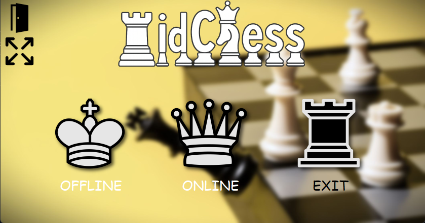
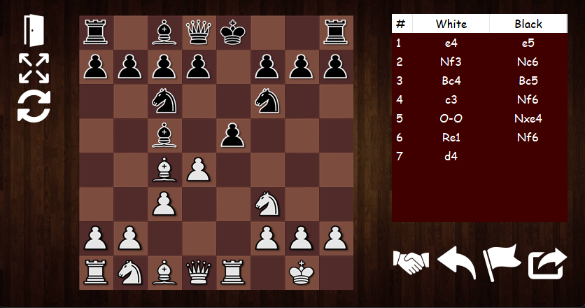

# MidChess

**MidChess** is a Windows Forms application built using **Microsoft .NET Framework 4.7.2** and **C#**. This project is an educational and learning-focused attempt at implementing a "mid" chess experience. It is designed to be simple to run, easy to use and visually appealing.  

---

## Screenshots


---



---

## Project Overview

MidChess currently supports:  
- **Offline Mode:** Two players on the same computer can play on a single board.  
- **LAN Mode:** Play against another player on the same network.  

The game emphasizes **educational purposes**, with a focus on clean code and UI design.  

---

## Features

- **Display & Window Scaling:** Dynamic font and window size scaling based on resolution.  
- **Simple UI:** A visually appealing interface for a polished chess experience.  
- **Low Memory Usage:** Lightweight implementation suitable for older machines.  
- **LAN Game Support:** Multiple server instances allow multiple games on the same network.  
- **Move History & Takeback:** Review previous moves and undo mistakes.
- **Swap View:** Swap board view between white and black.
- **Resign & Checkmate:** Standard chess mechanics implemented fully.  
- **Check Notification:** Alerts when a player is in check.  

---

## Technology Stack

- **Platform:** Windows Forms (.NET Framework 4.7.2)  
- **Language:** C#  
- **UI Design:** Custom scalable forms with dynamic fonts and sizes  

---

## System Requirements

- Minimum **screen resolution**: 640x480  
- Microsoft Windows OS compatible with .NET Framework 4.7.2  

---

## Installation

# MidChess - Usage and Contribution

## Installation

### A: Trough Visual Studio
1. Clone the repository
  ```bash
  git clone https://github.com/alexcontz/MidChess/
2. Open the project in **Visual Studio 2019 or later**.  
3. Build and run the solution.

### B: Using the release
1. Download the release
2. Run MidChess.exe

---

## Usage

### Offline Mode

1. Launch the application.  
2. Select **Offline Mode** from the main menu.  
3. Players take turns on the same computer using the interface.  
4. Use the move history panel for undoing moves or reviewing the game.  

### LAN Mode

1. Launch the application.  
2. Select **LAN Mode**.  
3. One player creates and hosts a server instance; the other connects via LAN.
4. Multiple server instances can run simultaneously for multiple LAN games (Using different ports!).  

---

## Future Improvements

- Implement AI opponents for single-player mode with custom difficulty scaling.  
- Add online multiplayer over the internet.  
- Introduce advanced custom gamemodes (e.g. Chess960).  
- Expand UI options for themes and board layouts.  
- Implement sound and timer

---

## Full documentation is available in the [documentation](./documentation) directory.

---

## Credits

See the [CREDITS](CREDITS.MD) file for details.  

## License

This project is licensed under the MIT Licence. See the [LICENSE](LICENSE.MD) file for details.  

---

## Contact

Created by **[Alexandru-Ioan Contz](https://github.com/alexcontz)**.   
For questions, suggestions, or support, open an issue in this repository.
